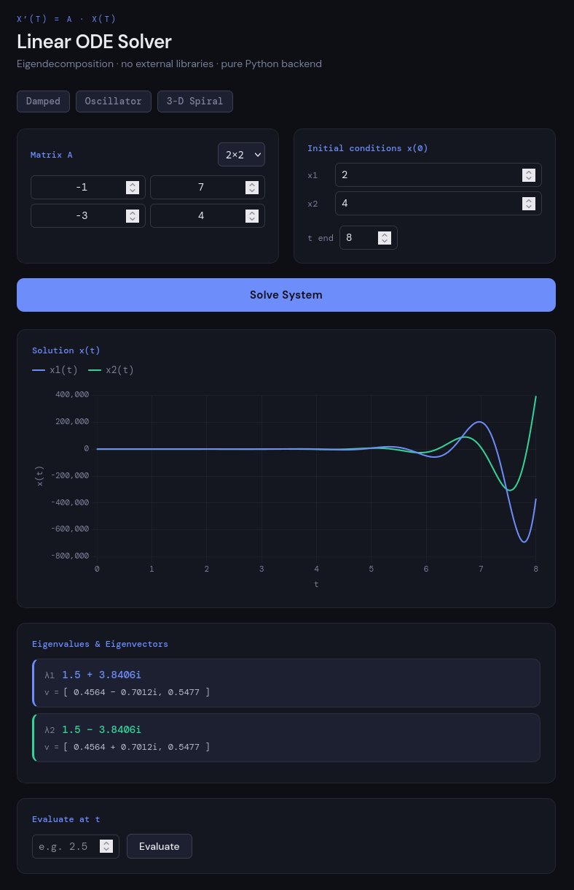

# Linear ODE Solver

A zero-dependency ODE solver in pure Python that resolves linear systems of ordinary differential equations using Linear Algebra, with no reliance on NumPy or SciPy. Now ships with a fully deployed React web interface.

---
 
## Live Demo
 
🔗 **[ode.sofahomelab.xyz](https://ode.sofahomelab.xyz)**
 

 
---

## How It Works

Given a linear system of the form:

```
x′(t) = A · x(t),    x(0) = x₀
```

The solver finds the exact solution using three stages of pure linear algebra:

1. **Newton's Divided Difference Interpolation** — samples `det(A − λI)` at `n+1` points and interpolates to recover the coefficients of the characteristic polynomial. No symbolic algebra is needed.

2. **Durand-Kerner Root Finding** — finds all roots of the characteristic polynomial (including complex conjugate pairs) using the Weierstrass iteration method, converging to all eigenvalues simultaneously.

3. **Eigenvector Decomposition** — for each eigenvalue `λₖ`, solves `(A − λₖI)v = 0` via Gaussian elimination to find the corresponding eigenvector. The general solution is then assembled as:

```
x(t) = c₁v₁e^(λ₁t) + c₂v₂e^(λ₂t) + ... + cₙvₙe^(λₙt)
```

The constants `c₁ … cₙ` are solved by applying the initial condition `x(0) = x₀`.

---

## Roadmap

| Feature | Status |
|---|---|
| Determinant via cofactor expansion | ✅ Complete |
| Characteristic polynomial via Newton interpolation | ✅ Complete |
| Eigenvalue finding via Durand-Kerner | ✅ Complete |
| Eigenvector solving via Gaussian elimination | ✅ Complete |
| Terminal interface (`main.py`) | ✅ Complete |
| Flask REST API (`api.py`) | ✅ Complete |
| React web frontend | ✅ Complete |
| Docker deployment (API + Web) | ✅ Complete |
| CI/CD via GitHub Actions | ✅ Complete |

---

## Web Interface

The React frontend connects to the Python solver via a Flask REST API and provides a full interactive GUI.

**Features:**
- `n×n` matrix input grid with a dimension selector (2×2, 3×3, 4×4)
- Initial condition inputs and configurable end time
- Preset systems (Damped, Oscillator, 3-D Spiral) for quick exploration
- Interactive solution chart (Chart.js) plotting all `xᵢ(t)` series
- Eigenvalue and eigenvector display panel with colour-coded cards
- Point evaluator — type any `t` value and read off `x(t)` by nearest sample

### Running Locally

**API backend:**
```bash
pip install flask flask-cors
python src/api.py          # starts on http://localhost:5050
```

**React frontend:**
```bash
cd web-server
npm install
npm run dev                # starts on http://localhost:8024
```

---

## Docker Deployment

The project ships with a multi-stage `Dockerfile` and a `docker-compose.yml` for production deployment. Docker images are automatically built and pushed to the GitHub Container Registry on every push to `main`.

**Run with Docker Compose:**
```bash
docker compose up
```

This starts two containers:

| Container | Port | Description |
|---|---|---|
| `ode-solver-api` | `5050` | Gunicorn-served Flask API (4 workers) |
| `ode-solver-web` | `8024` | Vite-built React frontend |

**Pull images directly:**
```bash
docker pull ghcr.io/yousuf-hamoda/ode-solver-api:latest
docker pull ghcr.io/yousuf-hamoda/ode-solver-web:latest
```

Images are kept up to date automatically via [Watchtower](https://containrrr.dev/watchtower/) labels included in the Compose file.

---

## CI/CD

A GitHub Actions workflow (`.github/workflows/docker-publish.yml`) builds and pushes both Docker images to the GitHub Container Registry on every push to `main`. No manual build steps are needed after merging.

---

## REST API

**`POST /solve`**

Request body:
```json
{
  "matrix":  [[0, 1], [-2, -3]],
  "x0":      [1, 0],
  "t_start": 0,
  "t_end":   10,
  "t_steps": 300
}
```

Response:
```json
{
  "t":           [0.0, 0.033, ...],
  "x":           [[1.0, 0.0], [0.97, -0.06], ...],
  "eigenvalues": [{"re": -1.0, "im": 0.0}, {"re": -2.0, "im": 0.0}],
  "eigenvectors": [[{"re": 0.71, "im": 0.0}, ...], ...]
}
```

---

## Terminal Usage

No external libraries required. Python 3.10+ only (uses `match` statements internally).

```bash
python src/main.py
```

You will be prompted to enter:
- The system dimension `n`
- The `n×n` matrix `A` row by row
- The initial condition vector `x(0)`
- A time range and number of steps

---

## Dependencies

| Layer | Dependencies |
|---|---|
| Python solver | None — pure Python 3.10+ stdlib only |
| Flask API | `flask`, `flask-cors`, `gunicorn` |
| React frontend | `react`, `chart.js`, `vite` |
| Deployment | Docker, GitHub Container Registry, GitHub Actions |
